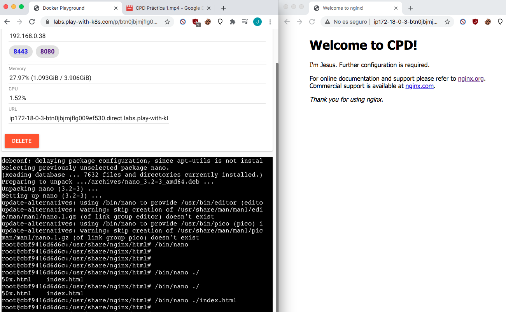
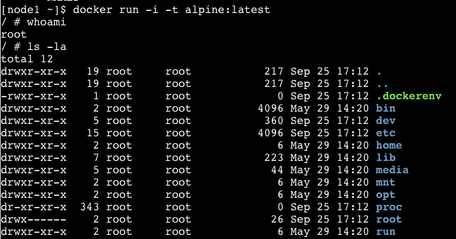
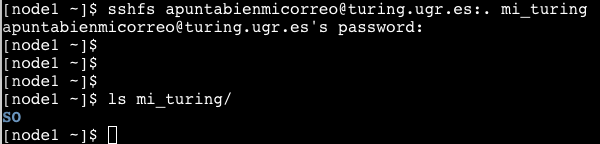

# Práctica 1. Contenedores Docker - CPD

## 1. Captura personalizada del acceso a NGINX con un fichero index.html modificado.

Aquí se ha modificado el html de la versión en ejecución. Al apagar la imagen de Docker y volver a iniciar, se volvería a tener el contenedor original.

## 2. Creación interactiva de un contenedor docker.

Aquí he usado una imagen de SO liviana, Alpine, como ejemplo de ejecución interactiva.

## 3. Acceso por SSHFS.

Me conecto con mi cuenta de Turing a mis documentos guardados. Se ve que tengo una carpeta que se llama "SO".

